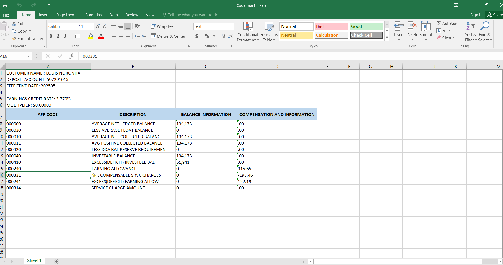
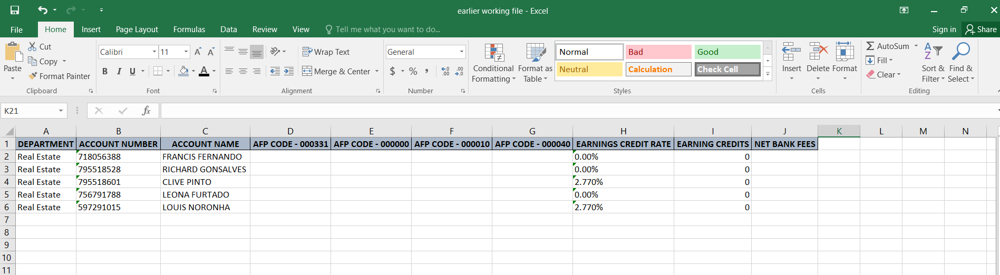
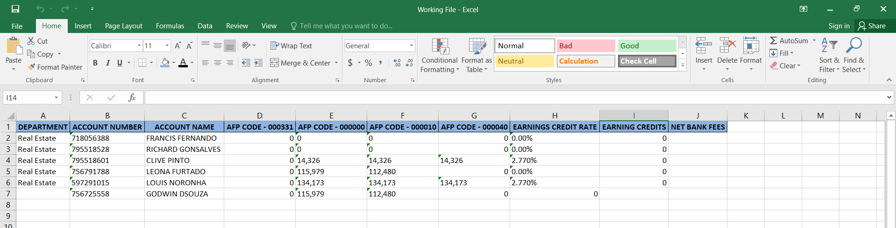

# 🏦 Bank Summary Report Automation using Python & Pandas

## ✅ Project Goal

To automate the creation of a consolidated **Bank Summary Report** by processing and merging data from multiple bank files. The script simulates a real world finance process where manual data entry is replaced with efficient Python automation.

### 📋 Business Rule Applied:
If **Earning Credit Rate (ECR)** = `0%`,  
→ then **set the amount in AFP Code `000040` to 0**.  
Otherwise, keep the amount as it is.

---

## 📌 Key Features

- Reads multiple customer Excel files from a folder (`Customer details/`)
- Extracts relevant fields: **Account Number**, **AFP Code**, and **Balance Information**
- Automatically updates required data according to the business rule in `Working File.xlsx` and also adds **new entries** if not present
- Enhances time efficiency by reducing manual data entry and streamlining the reporting process
- Works well for finance operations, treasury, and account summary automation tasks.

---

## 🧰 Tools Used

- Python 
- Pandas
- Excel 

---

## 🗂️ Project Folder Structure

bank-summary-automation/
├── My First Project.py
├── Working File.xlsx
├── Customer Details/
│   ├── Customer1.xlsx
│   ├── Customer2.xlsx 
│   ├── Customer3.xlsx 
│   ├── Customer4.xlsx
│   ├── Customer5.xlsx 
│   └── Customer6.xlsx
├── Screenshots/
│   ├── input_customer_file.png
│   ├── working_file_before.png
│   └── working_file_after.png
└── README.md

yaml
Copy
Edit

---

## 💼 Business Logic Implemented

This project simulates how a real financial analyst or back-office team would automate summary reports using rule-based logic:

- ✅ **Only new account records** are added to the master report (`Working File.xlsx`)
- 🧠 **Duplicate entries are ignored** to prevent redundancy
- 🔎 Extracts data based on **business-relevant fields**:  
  - **AFP Code** from a specific row/column  
  - **Balance info** from “Balance Information” section
- ⚙️ Handles inconsistencies in Excel file formats and sheet layouts
- 📁 Automates bulk processing of many customer files in one go — saving time and effort

---

## 🖼️ Screenshots

### 📥 Input File - Sample Customer Excel
A typical bank statement file from a customer:

---

### 📊 Working File - Before Script
How the main working file looked before running the script:

---

### 📈 Working File - After Script
Final output after merging and automating:

---

## 💡 What This Project Demonstrates

- Data cleaning and merging from multiple Excel files
- Use of conditional logic to avoid duplicate records
- Application of business logic to handle real-world formats
- Proficiency in Python and Pandas for data automation

---

## 🙋‍♀️ About Me

Hi, I'm **Priya Dsouza** — a former Mathematics Lecturer transitioning into **Data Analytics**.

I'm passionate about solving real-world data problems using:
- Python 🐍
- Excel 📊
- SQL 🔍

---

## 🔗 Connect With Me

- 💼 [LinkedIn](https://www.linkedin.com/in/priya-dsouza-3a50a8257)
- 📧 fdspriya1996@gmail.com

---

> ⭐ *Thank you for visiting this project. Feel free to give feedback or suggestions!*
